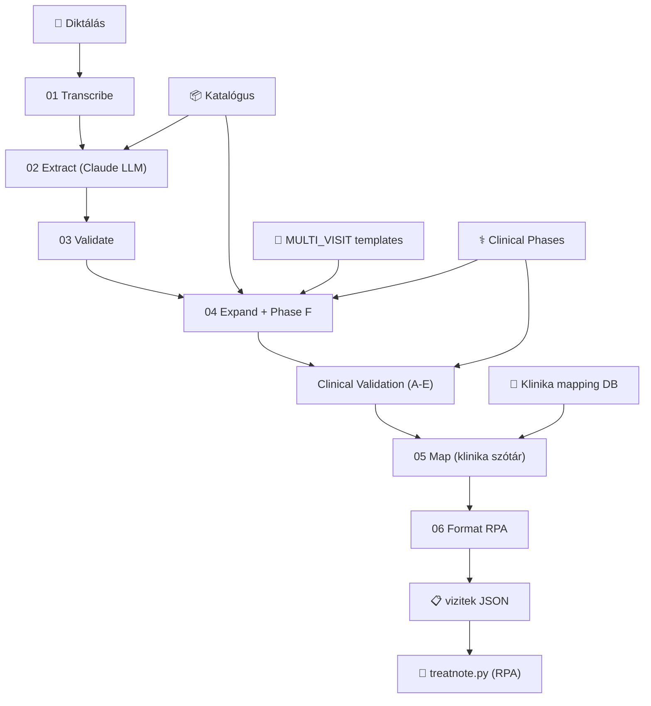

# TreatNote V2 Engine — Integrációs csomag

## Mi az engine?

Egy 7 lépéses klinikai pipeline, ami a fogorvos diktálásából RPA-kompatibilis kezelési tervet generál automatikus vizit-bontással.

```
Diktálás → Transcribe → LLM Extract → Validate → Expand → Clinical Validation → Map → RPA Output
```

---

## Fájl manifest

### 🔴 Engine core (kötelező)

| Fájl | Méret | Funkció |
|------|-------|---------|
| [orchestrator.ts](file:///Users/balazslederer/Desktop/treatnote_engine_test/treatnote_v2/src/pipeline/orchestrator.ts) | 3.4 KB | Fő belépési pont — `runPipeline()` |
| [01-transcribe.ts](file:///Users/balazslederer/Desktop/treatnote_engine_test/treatnote_v2/src/pipeline/01-transcribe.ts) | 1.6 KB | Hang→szöveg (Whisper) vagy text input |
| [02-extract.ts](file:///Users/balazslederer/Desktop/treatnote_engine_test/treatnote_v2/src/pipeline/02-extract.ts) | 5.7 KB | LLM (Claude) → ProtocolInstance[] |
| [03-validate.ts](file:///Users/balazslederer/Desktop/treatnote_engine_test/treatnote_v2/src/pipeline/03-validate.ts) | 3.7 KB | Paraméter validáció + default kitöltés |
| [04-expand.ts](file:///Users/balazslederer/Desktop/treatnote_engine_test/treatnote_v2/src/pipeline/04-expand.ts) | 11 KB | Scaling + multi-visit injection + Phase F |
| [05-map.ts](file:///Users/balazslederer/Desktop/treatnote_engine_test/treatnote_v2/src/pipeline/05-map.ts) | 4.2 KB | Atomi akció → klinika szótár tétel |
| [06-format-rpa.ts](file:///Users/balazslederer/Desktop/treatnote_engine_test/treatnote_v2/src/pipeline/06-format-rpa.ts) | 2.5 KB | `vizitek[]` output formázás |
| [clinical-phases.ts](file:///Users/balazslederer/Desktop/treatnote_engine_test/treatnote_v2/src/pipeline/clinical-phases.ts) | 5.4 KB | Fázis prioritás tábla + ACTION_TO_PHASE map |
| [clinical-validation.ts](file:///Users/balazslederer/Desktop/treatnote_engine_test/treatnote_v2/src/pipeline/clinical-validation.ts) | 8.1 KB | Pass A-E (dedup, klinikai sorrend, anatómia, márka, cross-vizit) |
| [visit-definitions.ts](file:///Users/balazslederer/Desktop/treatnote_engine_test/treatnote_v2/src/pipeline/visit-definitions.ts) | 8.2 KB | MULTI_VISIT template-ek (jövőbeli vizitek) |

### 🟡 Katalógus (kötelező, de bővíthető)

| Fájl | Funkció |
|------|---------|
| [atomic-actions.ts](file:///Users/balazslederer/Desktop/treatnote_engine_test/treatnote_v2/src/catalog/atomic-actions.ts) | Központi export + slug index |
| [actions-konzervalo.ts](file:///Users/balazslederer/Desktop/treatnote_engine_test/treatnote_v2/src/catalog/actions-konzervalo.ts) | Konzerváló akciók |
| [actions-surgical.ts](file:///Users/balazslederer/Desktop/treatnote_engine_test/treatnote_v2/src/catalog/actions-surgical.ts) | Sebészeti + implant akciók |
| [actions-fogpotlastan.ts](file:///Users/balazslederer/Desktop/treatnote_engine_test/treatnote_v2/src/catalog/actions-fogpotlastan.ts) | Protetikai akciók |
| [actions-diagnostic-kozos.ts](file:///Users/balazslederer/Desktop/treatnote_engine_test/treatnote_v2/src/catalog/actions-diagnostic-kozos.ts) | Diagnosztika + közös |
| [protocol-templates.ts](file:///Users/balazslederer/Desktop/treatnote_engine_test/treatnote_v2/src/catalog/protocol-templates.ts) | 40+ protokoll template |
| [defaults.ts](file:///Users/balazslederer/Desktop/treatnote_engine_test/treatnote_v2/src/catalog/defaults.ts) | Klinika default értékek |

### 🟢 Shared (kötelező)

| Fájl | Funkció |
|------|---------|
| [types.ts](file:///Users/balazslederer/Desktop/treatnote_engine_test/treatnote_v2/src/shared/types.ts) | Minden interface |
| [tooth-utils.ts](file:///Users/balazslederer/Desktop/treatnote_engine_test/treatnote_v2/src/shared/tooth-utils.ts) | FDI fog helper-ek |
| [embeddings.ts](file:///Users/balazslederer/Desktop/treatnote_engine_test/treatnote_v2/src/shared/embeddings.ts) | Embedding generálás (onboarding) |

### 🔵 DB (módosítandó az integráció alapján)

| Fájl | Funkció |
|------|---------|
| [client.ts](file:///Users/balazslederer/Desktop/treatnote_engine_test/treatnote_v2/src/db/client.ts) | SQLite connection (→ Supabase-re cserélendő) |
| [schema.sql](file:///Users/balazslederer/Desktop/treatnote_engine_test/treatnote_v2/src/db/schema.sql) | Tábla definíciók |
| [seed-catalog.ts](file:///Users/balazslederer/Desktop/treatnote_engine_test/treatnote_v2/src/db/seed-catalog.ts) | Katalógus seed |

### ⚫ Nem szükséges az integrációhoz

| Fájl/Könyvtár | Ok |
|------|---|
| `src/server.ts` | Express dev szerver — az éles platformnak sajátja van |
| `src/dashboard/` | Dev UI — az éles platformnak sajátja van |
| `src/onboarding/` | Klinika onboarding — az éles platformnak sajátja van |
| `test/` | Tesztfájlok |
| `treatnote.py` | RPA script — már megvan az éles rendszerben |

---

## Függőségek

```json
{
  "dependencies": {
    "better-sqlite3": "^11.0.0",   // → Supabase-re cserélendő
    "dotenv": "^16.4.0"
  }
}
```

### Külső API-k
- **Anthropic Claude** (`claude-sonnet-4-20250514`) — LLM extraction
- **OpenAI Whisper** — hangfelvétel transzkripció (opcionális)

### Env vars
```
ANTHROPIC_API_KEY=sk-ant-...
OPENAI_API_KEY=sk-...          # csak ha audio input kell
```

---

## Integrációs API

### Input
```typescript
const result = await runPipeline({
  telephelyId: 'uuid-...',     // klinika azonosító
  text: 'Tömés a 36-oson...',  // VAGY:
  audioBuffer: Buffer,          // hangfájl
});
```

### Output
```typescript
interface PipelineOutput {
  sessionId: string;
  transcript: string;
  extraction: ExtractResult;           // LLM nyers kimenet
  validation: ValidateResult;         // validált protokollok
  expansion: ExpandResult;            // expanded + vizit számok
  clinicalValidation: ValidationReport; // pass A-E report
  mapping: MapResult;                  // klinika szótár mapping
  rpaOutput: RpaOutput;               // ← EZT ESZI A treatnote.py
  timing: Record<string, number>;
}
```

### RPA Output formátum (treatnote.py kompatibilis)
```json
{
  "vizitek": [
    { "vizit": "vizit_1", "fog": "teljesszajureg", "name": "ICT érzéstelenítés" },
    { "vizit": "vizit_1", "fog": "14", "name": "Extractio, fogeltávolítás/db" },
    { "vizit": "vizit_2", "fog": "teljesszajureg", "name": "Parodontológia műtét utáni kontroll" },
    { "vizit": "vizit_3", "fog": "14", "name": "Fogbeültetés foganként NobelActive TiUltra" }
  ]
}
```

---

## DB séma (migrálni kell)

A pipeline 2 táblát olvas futás közben:

```sql
-- 1. Klinika default értékek
v2_clinic_defaults (telephely_id, overrides JSON)

-- 2. Klinika szótár mapping (atomi akció → Flexi-Dent tétel)
v2_clinic_mappings (
  id, telephely_id, atomic_action_slug,
  szotar_kezeles_id, szotar_kezeles_name,
  conditions JSON, confidence, reviewed
)
```

> [!IMPORTANT]
> A `05-map.ts` jelenleg **SQLite-ot** használ (`better-sqlite3`). Éles integrációnál ezt **Supabase**-re kell cserélni. A `getDb()` hívásokat `supabase.from(...)` hívásokra.

---

## Lépések az integrációhoz

### 1. Fájlok másolása
Másold a következő könyvtárakat az éles projektbe:
```
src/pipeline/     → az egész könyvtár
src/catalog/      → az egész könyvtár
src/shared/       → types.ts, tooth-utils.ts
```

### 2. DB adapter csere
Cseréld le a `src/db/client.ts`-t Supabase adapterre:
- `05-map.ts` → `v2_clinic_mappings` tábla lekérdezése
- `orchestrator.ts` → `v2_clinic_defaults` tábla lekérdezése

### 3. Env vars hozzáadása
```
ANTHROPIC_API_KEY=sk-ant-...
```

### 4. Pipeline hívás
```typescript
import { runPipeline } from './pipeline/orchestrator.js';

const result = await runPipeline({
  telephelyId: clinicId,
  text: doctorDictation,
});

// RPA output → stdin → treatnote.py
const rpaJson = JSON.stringify(result.rpaOutput);
```

---

## Tesztelt esetek

| Eset | Protokollok | Vizitek | Eredmény |
|------|-------------|---------|----------|
| Tömés 36 | 1× tobbfelszinu_tomes | 1 | ✅ |
| Cirkon korona 26 | 1× cirkon_korona_elso_ules | 2 (prep → átadás) | ✅ |
| Implant Nobel 36 | 1× implantatum_beultes_alap | 4 (műtét → kontroll → lenyomat → korona) | ✅ |
| Tömés + fogkő | 3× (tömés×2 + fogkő) | 1 (párhuzamos) | ✅ |
| Extractio → Implant | 2× (extractio + implant) | 6 (szekvenciális) | ✅ |
| Konzultáció + extractio + tömés | 3× (vizsgálat + extractio + tömés) | 2 (diagn+tömés → extractio) | ✅ |

---

## Architektúra diagram


